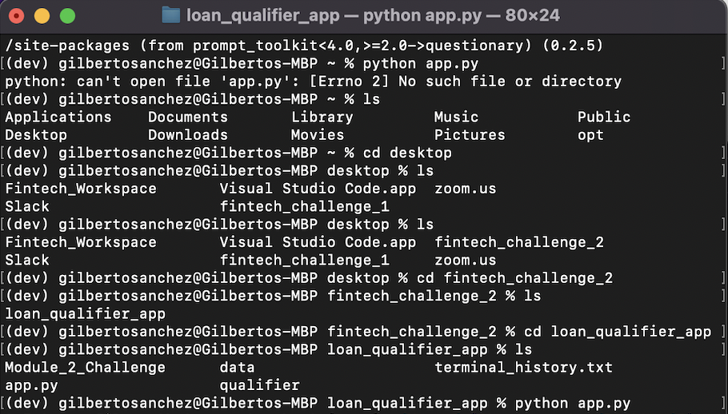
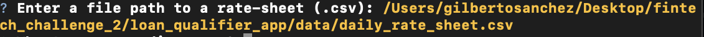
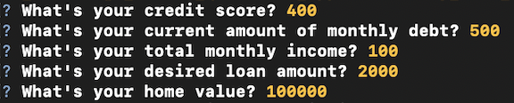
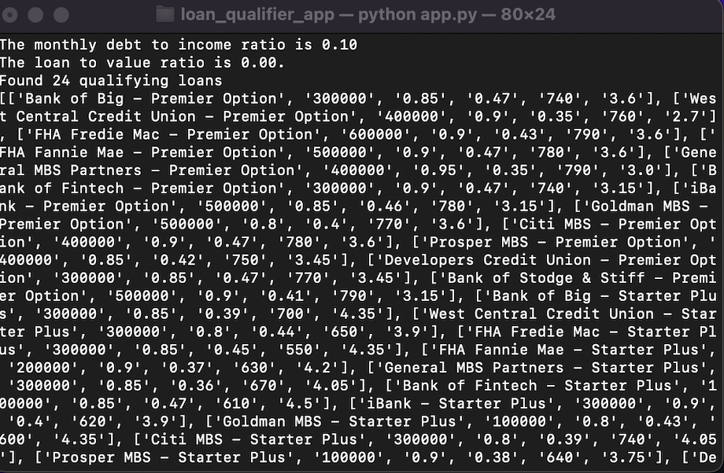
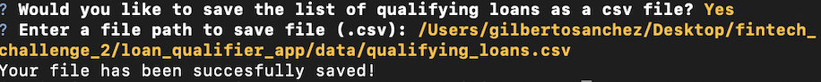
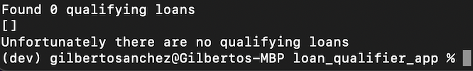

# Loan Qualifier Application

This project aims to help filter through a list of potential Lenders for someone looking for a loan. This project significantly reduces the amount of time it takes to filter through lists of rates from banks by using the users financial data to match potential lenders.
---

## Technologies
This loan qualifier application uses Python 3.7. Libraries included are as follows: sys, fire, questionary, path from pathlib and csv.

---

## Installation Guide

Must have fire and questionary installed for application to work. If not installed, install in your terminal/gitbash as follows:
pip install fire
pip install questionary

---

## Usage
To use this application you must download/clone this python script onto your local device and in your terminal/gitbash and type the following to start application from the folder where it was downloaded/cloned to:
python app.py

This should prompt you to enter a file path to the rate sheet containing the lender information that includes qualifying data.

After you enter the file path to the rate sheet, the program will ask you a series of questions regarding your personal financial information. Enter the following

If you qualify for any of the loans based on your financial data, the program will let you know how many loans you qualify for and will also print the loans you qualify for.

The program will ask if you would like to save the qualifying loans to a new csv file if there are more than 0 loans you qualify for.

 If there are 0 loans which you qualify for, the program will print a statement and exit.
 
 
  If you decide to save as a csv file, the program will save to a local csv file within the local folder. 
  
  
  If you decide not to save, the program will print a statement and exit the system.
  

---

## Contributors
Gilberto Sanchez
bertosanchez97@gmail.com
[LinkedIn] (www.linkedin.com/in/gilberto-sanchez-07aba314b)

---

## License

Original Source obtained from Columbia University's Fintech bootcamp.
